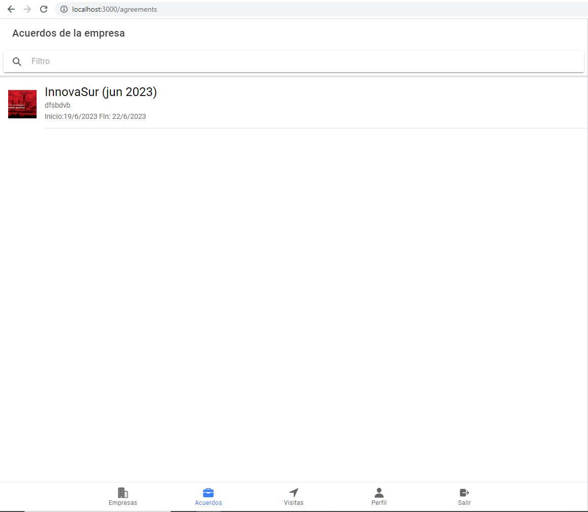
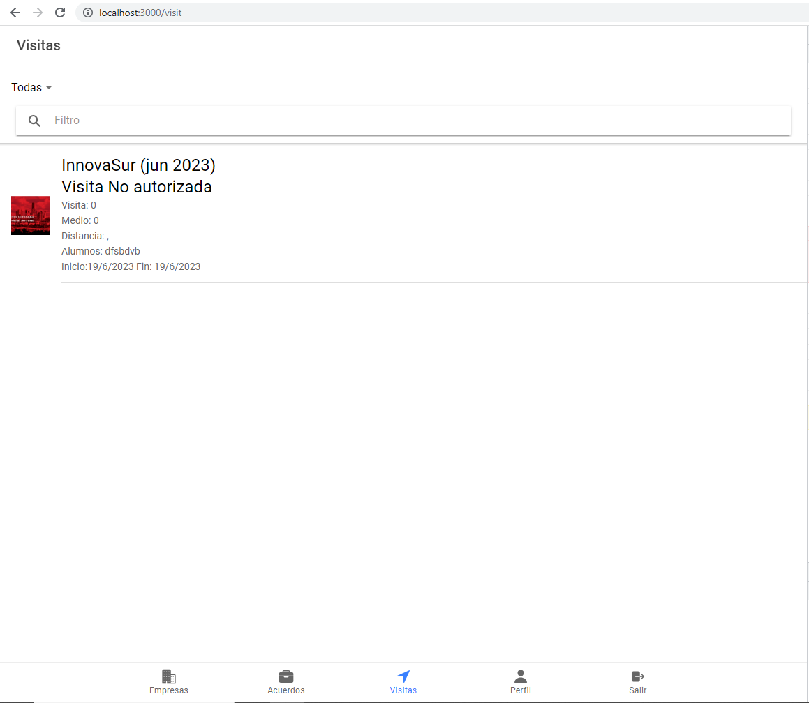

# FCT APP
## 1. Introducción
Aplicación que sirve para poder llevar un control sobre las empresas que contratan a los alumnos en las prácticas (frontend hecho en ionic/react, backend hecho en spring boot y la base de datos MySQL y Firebase). Permite iniciar sesión con Google. Todos los profesores puede ver las empresas agregadas a la lista de empresas. Los acuerdos con las empresas serán por usuario (a no ser que el usuario sea admin). Las visitas serán también por usuario (a no ser que el usuario sea admin). Se puede agregar al perfil un vehículo y una matrícula en caso de que el profesor tenga. Se puede cerrar sesión para volver a iniciar sesión con google.
## 2. Especificación de requisitos
- **Inicio de sesión** (Autenticación con Google).

- **Listado de empresas** con filtro para poder buscar el nombre de la empresa que queramos encontrar.

- **Añadido de empresas** (botón para añadir) con filtro para añadir automaticamente la empresa de internet sin tener que escribir los datos.

- **Eliminación de empresas** (hay que deslizar la empresa hacia la izquierda).

- **Listado de acuerdos** (por usuario) con filtro para poder buscar el nombre de la empresa que queramos encontrar.

- **Añadido de acuerdos** (deslizar la empresa hacia la izquierda). Hay que añadir el alumno que vaya a ir a esa empresa, su fecha de inicio y de fin.

- **Eliminación de acuerdos** (hay que deslizar el acuerdo hacia la izquierda).

- **Listado de visitas** (por usuario) con filtro para poder buscar el nombre de la empresa que queramos encontrar. También se pueden mostrar por autorizadas o no autorizadas.

- **Añadido de visitas** (deslizar el acuerdo hacia la izquierda). Aquí añades cosas como el método de transporte, el tiempo que dura la visita, etc.

- **Eliminación de visitas** (hay que deslizar la visita hacia la izquierda).

- **Autorización de la visita** (solo un usuario administrador puede autorizar una visita).

- **Añadido de vehículo propio**. Hay que añadir el modelo del vehículo y su matrícula.

- **Cierre de sesión**.

## 2.1 Futuras implementaciones
- Ver las empresas en google map (hay que deslizar la visita hacia la izquierda).
- Autenticación con Google en Spring Boot.
## 3. Diseño
### Diagrama de arquitectura

### Diagrama de clases

### Diagrama entidad relación

### Diagrama de casos de uso

## 4. Puesta en producción o despliegue
- Tener instalado MySQL y crear una base de datos
- Tener instalado node.js
- Tener una base de datos creada en firebase y poner la configuración en un archivo .env.local
- Cambiar todos los datos necesarios en el fichero application.properties (dentro de resources)
- Instalar todas las dependencias necesarias (npm install react-scrpits)
- Iniciar el frontend con "npm start"
- Iniciar el backend con la extensión de spring de vscode (recomendado) o con "mvn compile" y "mvn spring-boot:run"